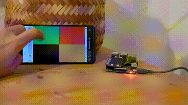

# Homeoffice "Traffic Light"
Runs a Flask server on a Raspberry Pi to quickly change the colors of an attached [Unicorn Hat Mini](https://shop.pimoroni.com/products/unicorn-hat-mini). This works from all web browsers in the same network.


## Setup
The [setup script](scripts/prepare_local_env.sh) creates a virtual environment and installs the needed requirements. 


## Usage
- Run the [startup script](scripts/run_flask.sh) to start the flask server on port 5000: ```/bin/bash scripts/run_flask.sh```
- Find out the IP Address of your Pi and connect to port 5000, e.g. `192.168.188.60:5000`.

